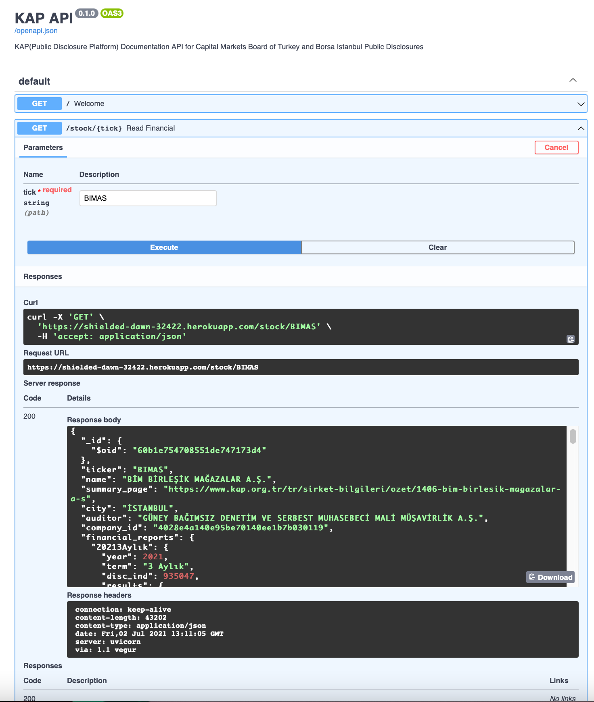

## kap_fastapi

Basic FastAPI and MongoDB implementation for KAP(Public Disclosure Platform of Turkey) Announcements.

Utilized [PyKap](https://github.com/cemsinano/pykap) to gather data into MongoDB.

### Deployed on Heroku:

It can be accessed via [this link](https://shielded-dawn-32422.herokuapp.com/docs).

## Example:

